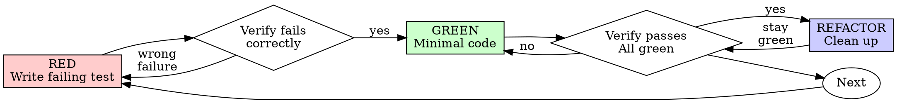

# Test-Driven Development (TDD)

## Overview

**Tests BEFORE Code.** ALWAYS write the test first. Watch it fail. Write minimal code to pass.

**Core principle:** If you didn't watch the test fail, you don't know if it tests the right thing.

**Violating the letter of the rules is violating the spirit of the rules.**

## The Iron Law

```
NO PRODUCTION CODE WITHOUT A FAILING TEST FIRST
```

Write code before the test? Delete it. Start over.

No exceptions:

- Don't keep it as "reference"
- Don't "adapt" it while writing tests
- Don't look at it
- Delete means delete

Implement fresh from tests. Period.

## When to Use

**Always:**

- New features
- Bug fixes
- Refactoring
- Behavior changes

**Exceptions (ask your human partner):**

- Throwaway prototypes
- Generated code
- Configuration files

## Write User Journeys

```
As a [role], I want to [action], so that [benefit]

Example:
As a user, I want to search for markets semantically,
so that I can find relevant markets even without exact keywords.
```

For each user journey, create comprehensive test cases.

## Red-Green-Refactor Cycle



### RED — Write One Failing Test

Write one minimal test showing what should happen.

<Good>

```typescript
test('retries failed operations 3 times', async () => {
  let attempts = 0;
  const operation = () => {
    attempts++;
    if (attempts < 3) throw new Error('fail');
    return 'success';
  };

  const result = await retryOperation(operation);

  expect(result).toBe('success');
  expect(attempts).toBe(3);
});
```

Clear name, tests real behavior, one thing.
</Good>

<Bad>

```typescript
test('retry works', async () => {
  const mock = jest
    .fn()
    .mockRejectedValueOnce(new Error())
    .mockRejectedValueOnce(new Error())
    .mockResolvedValueOnce('success');
  await retryOperation(mock);
  expect(mock).toHaveBeenCalledTimes(3);
});
```

Vague name, tests mock not code.
</Bad>

**Requirements:**

- One behavior per test
- Clear name describing behavior
- Real code (no mocks unless unavoidable)

### Verify RED — Watch It Fail (MANDATORY. Never skip.)

```bash
npm test path/to/test.test.ts
```

Confirm:

- Test fails (not errors)
- Failure message is expected
- Fails because feature missing (not typos)

**Test passes?** You're testing existing behavior. Fix test.

**Test errors?** Fix error, re-run until it fails correctly.

### GREEN — Minimal Code

Write simplest code to pass the test.

<Good>

```typescript
async function retryOperation<T>(fn: () => Promise<T>): Promise<T> {
  for (let i = 0; i < 3; i++) {
    try {
      return await fn();
    } catch (e) {
      if (i === 2) throw e;
    }
  }
  throw new Error('unreachable');
}
```

Just enough to pass.
</Good>

<Bad>

```typescript
async function retryOperation<T>(
  fn: () => Promise<T>,
  options?: {
    maxRetries?: number;
    backoff?: 'linear' | 'exponential';
    onRetry?: (attempt: number) => void;
  },
): Promise<T> {
  // YAGNI
}
```

Over-engineered.
</Bad>

Don't add features, refactor other code, or "improve" beyond the test.

### Verify GREEN — Watch It Pass (MANDATORY.)

```bash
npm test path/to/test.test.ts
```

Confirm:

- Test passes
- Other tests still pass
- Output pristine (no errors, warnings)

**Test fails?** Fix code, not test.

**Other tests fail?** Fix now.

### REFACTOR — Clean Up

After green only:

- Remove duplication
- Improve names
- Extract helpers
- Optimize performance
- Enhance readability

Keep tests green. Don't add behavior.

### Repeat

Next failing test for next feature.

## Test Types

See @test-types.md for a quick reference. Detailed guidance below.

### Unit Tests (Mandatory)

Test individual functions in isolation:

```typescript
import { calculateSimilarity } from './utils';

describe('calculateSimilarity', () => {
  it('returns 1.0 for identical embeddings', () => {
    const embedding = [0.1, 0.2, 0.3];
    expect(calculateSimilarity(embedding, embedding)).toBe(1.0);
  });

  it('returns 0.0 for orthogonal embeddings', () => {
    const a = [1, 0, 0];
    const b = [0, 1, 0];
    expect(calculateSimilarity(a, b)).toBe(0.0);
  });

  it('handles null gracefully', () => {
    expect(() => calculateSimilarity(null, [])).toThrow();
  });
});
```

When to use: pure functions, utilities, business logic, anything callable without network or database.

### Integration Tests (Mandatory)

Test API endpoints and database operations:

```typescript
import { NextRequest } from 'next/server';
import { GET } from './route';

describe('GET /api/markets/search', () => {
  it('returns 200 with valid results', async () => {
    const request = new NextRequest('http://localhost/api/markets/search?q=trump');
    const response = await GET(request, {});
    const data = await response.json();

    expect(response.status).toBe(200);
    expect(data.success).toBe(true);
    expect(data.results.length).toBeGreaterThan(0);
  });

  it('returns 400 for missing query', async () => {
    const request = new NextRequest('http://localhost/api/markets/search');
    const response = await GET(request, {});

    expect(response.status).toBe(400);
  });

  it('falls back to substring search when Redis unavailable', async () => {
    jest.spyOn(redis, 'searchMarketsByVector').mockRejectedValue(new Error('Redis down'));

    const request = new NextRequest('http://localhost/api/markets/search?q=test');
    const response = await GET(request, {});
    const data = await response.json();

    expect(response.status).toBe(200);
    expect(data.fallback).toBe(true);
  });
});
```

When to use: API routes, database queries, service interactions, external API calls, React components with hooks.

### E2E Tests (For Critical Flows)

Test complete user journeys with Playwright:

```typescript
import { test, expect } from '@playwright/test';

test('user can search and view market', async ({ page }) => {
  await page.goto('/');

  await page.fill('input[placeholder="Search markets"]', 'election');
  await page.waitForTimeout(600); // Debounce

  const results = page.locator('[data-testid="market-card"]');
  await expect(results).toHaveCount(5, { timeout: 5000 });

  await results.first().click();

  await expect(page).toHaveURL(/\/markets\//);
  await expect(page.locator('h1')).toBeVisible();
});
```

When to use: critical user flows, multi-step processes, checkout/auth flows. Reference `/e2e` command for E2E-specific workflow.

## Mocking Patterns

Mock external dependencies only when unavoidable. Prefer integration tests with real components when mock setup exceeds test logic complexity. See @testing-anti-patterns.md for common pitfalls.

### Mock Supabase

```typescript
jest.mock('@/lib/supabase', () => ({
  supabase: {
    from: jest.fn(() => ({
      select: jest.fn(() => ({
        eq: jest.fn(() =>
          Promise.resolve({
            data: mockMarkets,
            error: null,
          }),
        ),
      })),
    })),
  },
}));
```

### Mock Redis

```typescript
jest.mock('@/lib/redis', () => ({
  searchMarketsByVector: jest.fn(() =>
    Promise.resolve([
      { slug: 'test-1', similarity_score: 0.95 },
      { slug: 'test-2', similarity_score: 0.9 },
    ]),
  ),
}));
```

### Mock OpenAI

```typescript
jest.mock('@/lib/openai', () => ({
  generateEmbedding: jest.fn(() => Promise.resolve(new Array(1536).fill(0.1))),
}));
```

## Edge Cases to Always Test

1. **Null/Undefined** — What if input is null?
2. **Empty** — What if array/string is empty?
3. **Invalid Types** — What if wrong type passed?
4. **Boundaries** — Min/max values
5. **Errors** — Network failures, database errors
6. **Race Conditions** — Concurrent operations
7. **Large Data** — Performance with 10k+ items
8. **Special Characters** — Unicode, emojis, SQL characters

## Good Tests

| Quality          | Good                                | Bad                                                 |
| ---------------- | ----------------------------------- | --------------------------------------------------- |
| **Minimal**      | One thing. "and" in name? Split it. | `test('validates email and domain and whitespace')` |
| **Clear**        | Name describes behavior             | `test('test1')`                                     |
| **Shows intent** | Demonstrates desired API            | Obscures what code should do                        |
| **Independent**  | Setup data in each test             | Relies on previous test's side effects              |
| **Behavioral**   | Tests user-visible behavior         | Tests internal state or implementation details      |

## Verification Checklist

Before marking work complete:

- [ ] Every new function/method has a test written before it
- [ ] Watched each test fail before implementing
- [ ] Each test failed for expected reason (feature missing, not typo)
- [ ] Wrote minimal code to pass each test
- [ ] All tests pass
- [ ] Output pristine (no errors, warnings)
- [ ] Tests use real code (mocks only if unavoidable)
- [ ] Edge cases and errors covered
- [ ] Boundary conditions verified
- [ ] All public functions have unit tests
- [ ] All API endpoints have integration tests
- [ ] Critical user flows have E2E tests
- [ ] Coverage is 80%+ (verify with coverage report)

Can't check all boxes? You skipped TDD. Start over.

## Coverage Requirements

```bash
npm run test:coverage
open coverage/lcov-report/index.html
```

Required thresholds:

- Branches: 80%
- Functions: 80%
- Lines: 80%
- Statements: 80%

100% required for:

- Financial calculations
- Authentication logic
- Security-critical code
- Core business logic

## Continuous Testing

```bash
npm test -- --watch       # Watch mode during development
npm test && npm run lint  # Before commit
npm test -- --coverage --ci  # CI/CD
```

## When Stuck

| Problem                | Solution                                                             |
| ---------------------- | -------------------------------------------------------------------- |
| Don't know how to test | Write wished-for API. Write assertion first. Ask your human partner. |
| Test too complicated   | Design too complicated. Simplify interface.                          |
| Must mock everything   | Code too coupled. Use dependency injection.                          |
| Test setup huge        | Extract helpers. Still complex? Simplify design.                     |

## Red Flags — STOP and Start Over

- Code before test
- Test after implementation
- Test passes immediately
- Can't explain why test failed
- Tests added "later"
- Rationalizing "just this once"
- "I already manually tested it"
- "Tests after achieve the same purpose"
- "It's about spirit not ritual"
- "Keep as reference" or "adapt existing code"
- "Already spent X hours, deleting is wasteful"
- "TDD is dogmatic, I'm being pragmatic"
- "This is different because..."

**All of these mean: Delete code. Start over with TDD.**

## Bug Fix Example

**Bug:** Empty email accepted

**RED:**

```typescript
test('rejects empty email', async () => {
  const result = await submitForm({ email: '' });
  expect(result.error).toBe('Email required');
});
```

**Verify RED:**

```bash
$ npm test
FAIL: expected 'Email required', got undefined
```

**GREEN:**

```typescript
function submitForm(data: FormData) {
  if (!data.email?.trim()) {
    return { error: 'Email required' };
  }
  // ...
}
```

**Verify GREEN:**

```bash
$ npm test
PASS
```

**REFACTOR:** Extract validation for multiple fields if needed.

## Testing Anti-Patterns

When adding mocks or test utilities, read @testing-anti-patterns.md to avoid common pitfalls:

- Testing mock behavior instead of real behavior
- Adding test-only methods to production classes
- Mocking without understanding dependencies
- Incomplete mocks that mirror partial API structure
