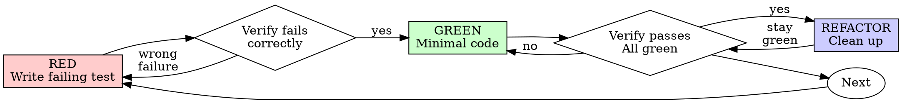

# Test-Driven Development (TDD)

## Overview

**Tests BEFORE Code** ALWAYS write the test first. Watch it fail. Write minimal code to pass.

**Core principle:** If you didn't watch the test fail, you don't know if it tests the right thing.

**Violating the letter of the rules is violating the spirit of the rules.**

## When to Use

**Always:**

- New features
- Bug fixes
- Refactoring
- Behavior changes

**Exceptions (ask your human partner):**

- Throwaway prototypes
- Generated code
- Configuration files

Thinking "skip TDD just this once"? Stop. That's rationalization.

## The Iron Law

```
NO PRODUCTION CODE WITHOUT A FAILING TEST FIRST
```

Write code before the test? Delete it. Start over.

**No exceptions:**

- Don't keep it as "reference"
- Don't "adapt" it while writing tests
- Don't look at it
- Delete means delete

Implement fresh from tests. Period.

## Write User Journeys

```
As a [role], I want to [action], so that [benefit]

Example:
As a user, I want to search for markets semantically,
so that I can find relevant markets even without exact keywords.
```

For each user journey, create comprehensive test cases

## Red-Green-Refactor



### RED - Write Failing Test

Write one minimal test showing what should happen.

<Good>
```typescript
test('retries failed operations 3 times', async () => {
  let attempts = 0;
  const operation = () => {
    attempts++;
    if (attempts < 3) throw new Error('fail');
    return 'success';
  };

const result = await retryOperation(operation);

expect(result).toBe('success');
expect(attempts).toBe(3);
});

````
Clear name, tests real behavior, one thing
</Good>

<Bad>
```typescript
test('retry works', async () => {
  const mock = jest.fn()
    .mockRejectedValueOnce(new Error())
    .mockRejectedValueOnce(new Error())
    .mockResolvedValueOnce('success');
  await retryOperation(mock);
  expect(mock).toHaveBeenCalledTimes(3);
});
````

Vague name, tests mock not code
</Bad>

**Requirements:**

- One behavior
- Clear name
- Real code (no mocks unless unavoidable)

### Verify RED - Watch It Fail

**MANDATORY. Never skip.**

```bash
npm test path/to/test.test.ts
```

Confirm:

- Test fails (not errors)
- Failure message is expected
- Fails because feature missing (not typos)

**Test passes?** You're testing existing behavior. Fix test.

**Test errors?** Fix error, re-run until it fails correctly.

### GREEN - Minimal Code

Write simplest code to pass the test.

<Good>
```typescript
async function retryOperation<T>(fn: () => Promise<T>): Promise<T> {
  for (let i = 0; i < 3; i++) {
    try {
      return await fn();
    } catch (e) {
      if (i === 2) throw e;
    }
  }
  throw new Error('unreachable');
}
```
Just enough to pass
</Good>

<Bad>
```typescript
async function retryOperation<T>(
  fn: () => Promise<T>,
  options?: {
    maxRetries?: number;
    backoff?: 'linear' | 'exponential';
    onRetry?: (attempt: number) => void;
  }
): Promise<T> {
  // YAGNI
}
```
Over-engineered
</Bad>

Don't add features, refactor other code, or "improve" beyond the test.

### Verify GREEN - Watch It Pass

**MANDATORY.**

```bash
npm test path/to/test.test.ts
```

Confirm:

- Test passes
- Other tests still pass
- Output pristine (no errors, warnings)

**Test fails?** Fix code, not test.

**Other tests fail?** Fix now.

### REFACTOR - Clean Up

After green only:

- Remove duplication
- Improve names
- Extract helpers
- Optimize performance
- Enhance readability

Keep tests green. Don't add behavior.

### Repeat

Next failing test for next feature.

## Good Tests

| Quality          | Good                                | Bad                                                 |
| ---------------- | ----------------------------------- | --------------------------------------------------- |
| **Minimal**      | One thing. "and" in name? Split it. | `test('validates email and domain and whitespace')` |
| **Clear**        | Name describes behavior             | `test('test1')`                                     |
| **Shows intent** | Demonstrates desired API            | Obscures what code should do                        |

## Red Flags - STOP and Start Over

- Code before test
- Test after implementation
- Test passes immediately
- Can't explain why test failed
- Tests added "later"
- Rationalizing "just this once"
- "I already manually tested it"
- "Tests after achieve the same purpose"
- "It's about spirit not ritual"
- "Keep as reference" or "adapt existing code"
- "Already spent X hours, deleting is wasteful"
- "TDD is dogmatic, I'm being pragmatic"
- "This is different because..."

**All of these mean: Delete code. Start over with TDD.**

## Example: Bug Fix

**Bug:** Empty email accepted

**RED**

```typescript
test("rejects empty email", async () => {
  const result = await submitForm({ email: "" });
  expect(result.error).toBe("Email required");
});
```

**Verify RED**

```bash
$ npm test
FAIL: expected 'Email required', got undefined
```

**GREEN**

```typescript
function submitForm(data: FormData) {
  if (!data.email?.trim()) {
    return { error: "Email required" };
  }
  // ...
}
```

**Verify GREEN**

```bash
$ npm test
PASS
```

**REFACTOR**
Extract validation for multiple fields if needed.

## Verification Checklist

Before marking work complete:

- [ ] Every new function/method has a test
- [ ] Watched each test fail before implementing
- [ ] Each test failed for expected reason (feature missing, not typo)
- [ ] Wrote minimal code to pass each test
- [ ] All tests pass
- [ ] Output pristine (no errors, warnings)
- [ ] Tests use real code (mocks only if unavoidable)
- [ ] Edge cases and errors covered
- [ ] Boundary conditions verified

Can't check all boxes? You skipped TDD. Start over.

## When Stuck

| Problem                | Solution                                                             |
| ---------------------- | -------------------------------------------------------------------- |
| Don't know how to test | Write wished-for API. Write assertion first. Ask your human partner. |
| Test too complicated   | Design too complicated. Simplify interface.                          |
| Must mock everything   | Code too coupled. Use dependency injection.                          |
| Test setup huge        | Extract helpers. Still complex? Simplify design.                     |

## Debugging Integration

Bug found? Write failing test reproducing it. Follow TDD cycle. Test proves fix and prevents regression.

Never fix bugs without a test.

## Testing Anti-Patterns

When adding mocks or test utilities, read @testing-anti-patterns.md to avoid common pitfalls:

- Testing mock behavior instead of real behavior
- Adding test-only methods to production classes
- Mocking without understanding dependencies

## Final Rule

```
Production code → test exists and failed first
Otherwise → not TDD
```

No exceptions without your human partner's permission.
